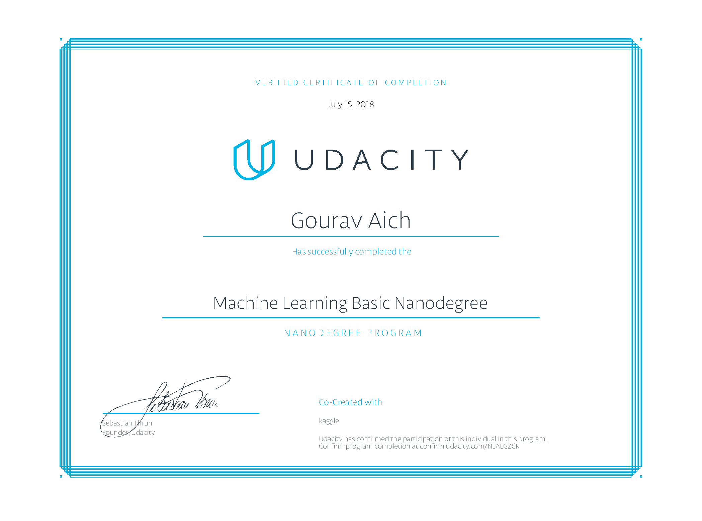
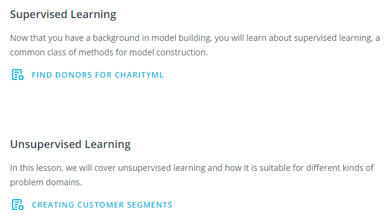

# Machine Learning Basic Nanodegree

### About

This repository contains project work for Udacity's [Machine Learning Basic Nanodegree](https://in.udacity.com/course/machine-learning-engineer-nanodegree--nd009t) from the May 2018 cohort.

### Course Overview

</img>
